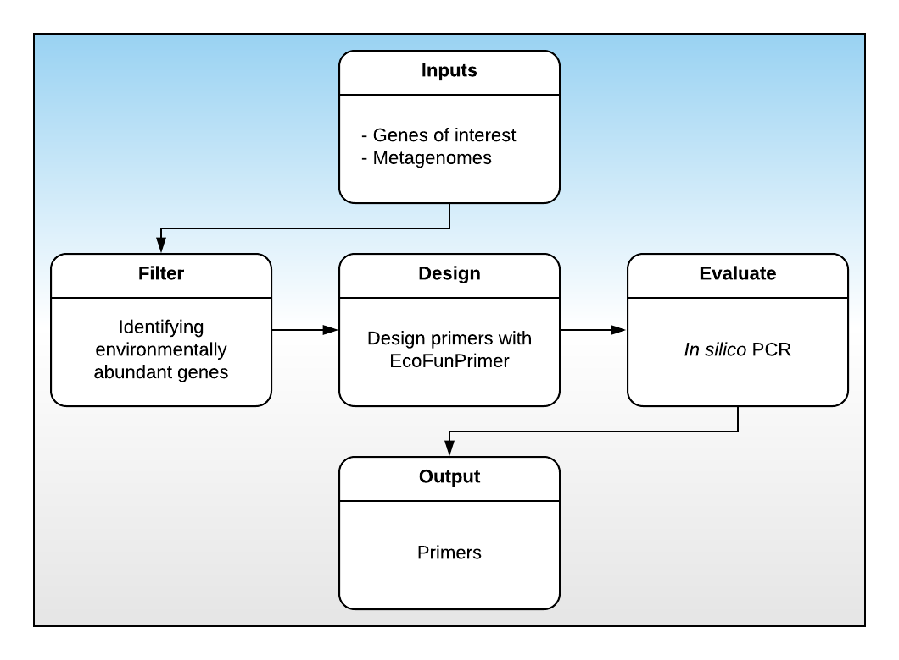

```{r setup, include=FALSE}
knitr::opts_chunk$set(echo = TRUE, cache = TRUE)
```

I'm currently developing a primer design pipeline for the [GERMS lab](http://www.germslab.org/). The pipeline takes as input a `fasta` file containing the genes of interest and a directory of metagenomes. The pipeline then clusters the genes, identifies which genes are abundant in the submitted metagenomes, and designs primers for those sequences. See below for an overview of the process:



Today, we will working on the *Filter* step. This step is comprised of the following:

1. Choose an optimum similarity threshold for gene clustering
2. Quantify environmental abundance and presence by BLAST the representative sequences against the metagenomes
3. Determine which clusters to include 
4. Extract the nucleotide sequences

Querying the sequences against all the metagenomes takes more computational resources and time than are available to us today, so we will only be reproducing steps 1, 3, and 4.

## Choosing an optimum similarity threshold

Let's begin by looking at our input files. The `data/sequence_info` directory has the nucleotide and protein sequences for our gene of interest. Let's take a look at them:

```{bash}
head data/sequence_info/amoa_prot.fa
```

```{bash}
head data/sequence_info/amoa_nuc.fa
```


```{bash}
pwd
```


### A review of `grep`

The `grep` function is used to search a file (or stream) for a term of interest. For example, 

#### Exercise

## Determine which clusters to include 

