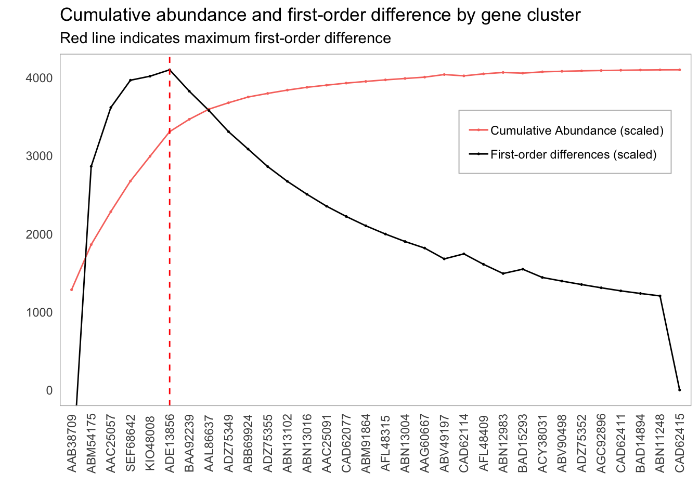

```{r setup, include=FALSE}
knitr::opts_chunk$set(echo = TRUE, cache = TRUE)
```

According to the first-order difference criterion, the optimal clustering similarity was 98%. However, for various reasons (mostly due to physical limitations), we ended up choosing a 95% similarity threshold. 

After determining this, we then used the representative sequences found in `0.95.fa` and queried them against our metagenomes. Thus, for each metagenome, we had an output file containing all the relevant hits. We then used a Python script to summarize the abundance and presence of each these representative sequences across our metagenomes. This information can be found in `data/abundance_presence.tsv`.

Our job now is to determine which of these clusters to include. While it would be nice to design primers for all of the sequences and 

Our goal is to reproduce the following graph:



We'll begin by learning about visualizations. I have [an introduction to ggplot2 here](https://pommevilla.github.io/p3.bootcamp.r.2019/lesson_2.html), but we will begin with quick review before we start tackling this one.

## Basic visualizations

We'll begin by loading in our required packages.

```{r}
library(ggplot2)
library(tidyverse)
```

Before we tackle our goal, let's warm up on `mtcars`.

### Exercise 2.1

* Reproduce the below graph. How can it be improved?:

```{r, echo = FALSE}
mtcars %>% 
  ggplot(aes(wt, mpg)) +
  geom_point(aes(color = cyl)) + 
  theme_light() +
  labs(title = "Weight versus miles per gallon")
```


## Importing and transforming data

Let's load in the `tft_stats.tsv` data set.

```{r}
tft_stats <- read.delim("data/practice_data/tft_stats.tsv")
tft_stats
```

We can quickly visualize this by throwing it into `ggplot`:

```{r}
tft_stats %>% 
  ggplot(aes(rank, percent)) + 
  geom_col() + 
  theme(axis.text.x = element_text(angle = 90))
```

Note that `ggplot` will automatically reorder your data if it doesn't think it's sorted. We can get around this by telling `ggplot` that the data already is in the correct order (adapted from [this Stack Overflow post](https://stackoverflow.com/a/38132711)):

```{r}
tft_stats$rank <- factor(tft_stats$rank, levels = tft_stats$rank)
```

Now, when we plot the data frame, the order will remain:

```{r}
tft_stats %>% 
  ggplot(aes(rank, percent)) + 
  geom_col() +
  theme(axis.text.x = element_text(angle = 90)) 
```

Let's go ahead and fix this up:

```{r}
tft_stats %>% 
  ggplot(aes(rank, percent)) + 
  theme_light() +
  geom_col() +
  labs(x = "Rank",
       y = "Percent of player base",
       title = "Distribution of players across ranks in Team Fight Tactics",
       subtitle = "through August 2019; source: lolchess.gg") + 
  theme(axis.text.x = element_text(angle = 90, hjust = 1)) 

```

We're going to use the `mutate` function. `mutate` lets us add columns to a data frame based on other columns. For instance, we can add a column to `mtcars` to store the ratio between `hp` and `wt`:

```{r}
mtcars %>% 
  mutate(hp_to_wt = hp / wt)
```

And we can go ahead and plot this new variable right away:

```{r}
mtcars %>% 
  mutate(hp_to_wt = hp / wt) %>% 
  ggplot(aes(x = hp / wt, y = qsec)) +
  geom_point() + 
  labs(x = "Horsepower-to-weight ratio (hp / lb)",
       y = "Quarter-mile time (seconds)",
       title = "Horsepower-to-weight ratio vs. quarter-mile time") + 
  theme_light()
```

Just like with `summarise`, we can create multiple new variables at the same time with `mutate`:

```{r}
mtcars %>% 
  mutate(hp_to_wt = hp / wt,
         proj_hsec = 2 * qsec)
```


Let's go ahead and use `mutate` to add a cumulative percentage column to `tft_stats`. This is done with the `cumsum` function:

```{r}
tft_stats %>% 
  mutate(cumulative_percent = cumsum(percent)) 
```

And we can now add this line to our graph as another layer:

```{r}
tft_stats %>% 
  mutate(cumulative = cumsum(percent)) %>% 
  ggplot(aes(x = rank, group = 1)) + 
  theme_light() + 
  geom_col(aes(y = percent)) +
  geom_line(aes(y = cumulative), color = "red")
```

### Exercise 2.2

There are several things wrong with the `tft_stats` graph.

* What's wrong with the y-axis? Use `mutate` to correct this.
* What's wrong with the cumulative percentage line? How can we fix this? Hint: Using [min-max normalization](https://en.wikipedia.org/wiki/Feature_scaling) (with the `max` function) will get you part of the way there. What can you multiply this rescaled number by to fit with the rest of the graph? What do you think about the clarity of this graph?
* After fixing the line, pretty up the rest of the graph. Make the cumulative percentage line dashed.

Read in `abundance_presence.tsv` with:

```{r}
presence_abundance <- read.delim("data/abundance_presence.tsv")
```

Recreate the graph below:

```{r, echo = FALSE}
presence_abundance %>% 
  mutate(cumulative_percent = cumsum(abundance) / sum(abundance) * max(abundance)) %>% 
  ggplot(aes(x = reorder(gene, -abundance), group = 1)) +
  theme_light() + 
  geom_line(aes(y = abundance)) + 
  geom_line(aes(y = cumulative_percent), color = "red", linetype = "dashed") + 
  theme(axis.text.x = element_text(angle = 90, vjust = 0.5)) + 
  labs(x = "",
       y = "Abundance",
       title = "Abundance of representative genes in sample metagenomes",
       subtitle = "Cumulative abundance in red")
```

Some hints:

* We normalized the cumulative percentage curve in the `tft_stats` graph with the following formula:

```{r}
tft_stats %>% 
  mutate(percent = percent / 100,
         cumulative = cumsum(percent) * max(percent)) 
```

However, if you try to do the same thing with the `presence_abundance` data frame, you won't get the desired result. This is because the formula above is actually shorthand for:

```{r}
tft_stats %>% 
  mutate(percent = percent / 100,
         cumulative = cumsum(percent) / 1 * max(percent)) 
```

What does the 1 represent? How can we apply that to `presence_abundance`?

## Choosing an inclusion threshold

We have most of what we need to make the desired visualization. All we need now is to replace the black line with the first-order differences, plot that, and put a vertical line to show the inclusion threshold. Just like when we calculated the first-order difference on the command line, the actual code is beyond the scope of this class. Run the following lines to add the first-order difference information to the `presence_abundance` data frame:

```{r}
presence_abundance <- presence_abundance %>% 
  mutate(cumulative_percent = cumsum(abundance) / sum(abundance) * max(abundance))
fo_difference <- function(pos){
  left <- (presence_abundance[pos, 4] - presence_abundance[1, 4]) / pos
  right <- (presence_abundance[nrow(presence_abundance), 4] - presence_abundance[pos, 4]) / (nrow(presence_abundance) - pos)
  return(left - right)
}
presence_abundance$fo_diffs <- sapply(1:nrow(presence_abundance), fo_difference)
presence_abundance[is.na(presence_abundance)] <- 0
```

Let's go ahead and plot the first-order differences against the cumulative percentage:

```{r}
presence_abundance %>% 
  mutate(fo_diffs = fo_diffs / max(fo_diffs) * max(abundance)) %>% 
  ggplot(aes(x = reorder(gene, -abundance), group = 1)) +
  theme_light() + 
  geom_line(aes(y = fo_diffs)) + 
  geom_line(aes(y = cumulative_percent), color = "red", linetype = "dashed") + 
  theme(axis.text.x = element_text(angle = 90, vjust = 0.5)) + 
  labs(x = "",
       y = "Abundance",
       title = "Abundance of representative genes in sample metagenomes")
```

All that's left to do is to identify the cluster that achieves the maximal first-order difference. This can be done with the following:

```{r}
(elbow <- which.max(presence_abundance$fo_diffs))
```

Now we can add a vertical line to the plot with `geom_vline`:

```{r}
presence_abundance %>% 
  mutate(fo_diffs = fo_diffs / max(fo_diffs) * max(abundance)) %>% 
  ggplot(aes(x = reorder(gene, -abundance), group = 1)) +
  theme_light() + 
  geom_line(aes(y = fo_diffs)) + 
  geom_line(aes(y = cumulative_percent), color = "red", linetype = "dashed") + 
  geom_vline(xintercept = elbow, color = "red") + 
  theme(axis.text.x = element_text(angle = 90, vjust = 0.5)) + 
  labs(x = "",
       y = "Abundance",
       title = "Abundance of representative genes in sample metagenomes")
```

### Exercise 2.3

* While we have identified the optimal line, it may be the case that points which are less optimal theoretically are more desirable for other practical reasons. For instance, suppose that we are okay with inclusion thresholds within 10% of the point which maximizes the first-order difference. How would you find this neighborhood? Show it on the graph using `geom_vline`?
* The first-order difference only took into account the abundance of each particular gene. How might we also account for the presence of gene across the metagenome?

## Getting the nucleotide sequences for primer design

Now that we have decided on a cluster inclusion threshold, we can now prepare a `fasta` file for input into a primer design software. So far, we have been working with the protein sequences. [EcoFunPrimer](https://github.com/rdpstaff/EcoFunPrimer), the primer design software that we are preparing this for, requires a `fasta` file of nucleotide sequences. The file `amoa_nuc.fa` contains the corresponding nucleotide sequences for each of the protein sequences we have. However, the sequence names are not the same between the two files. We have the mapping between the protein and nucleotide sequences in the `protein_nucleotide_mapping.tsv`. Let's take a look at it:

```{bash}
head data/sequence_info/protein_nucleotide_mapping.tsv
```

We know enough to extract the nucleotide sequence ID from the mapping file for each of the protein clusters that we're including, and use that to search the `amoa_nuc.fa` file for the sequences.

```{r}
presence_abundance[1:6, ] 
```


## Exercise 2.4
* Subset the `presence_abundance` data frame to include all the sequences up until the inclusion threshold and extract the gene name column. Read the documentation for `write_tsv` to write this out to a file called `abundant_genes.tsv`. Write this without the column names.
* We now want to search `protein_nucleotide_mapping.tsv` for the corresponding nucleotide ID sequences. In other words, we want to grep `protein_nucleotide_mapping.tsv` with multiple search terms. Note that this is the opposite situation from what we did at the beginning of this workshop where we searched multiple files for one search term. Look through the `grep` documentation and find out which flag to use to use a file for input. Extract only the nucleotide sequence from this output.
* Pipe this output to another `grep` command to search the `amoa_nuc.fa` file for these sequences. This will give us the sequence headers, but we also want the actual sequences. Look through the `grep` documentation (or search online) to figure out how to include a certain number of lines after a successful match. How many lines should we include afterwards? What are some considerations regarding `fasta` file content that we have to keep in mind when doing this?


And that's it! Go ahead and save this to a file called `abundant_genes.fa`.